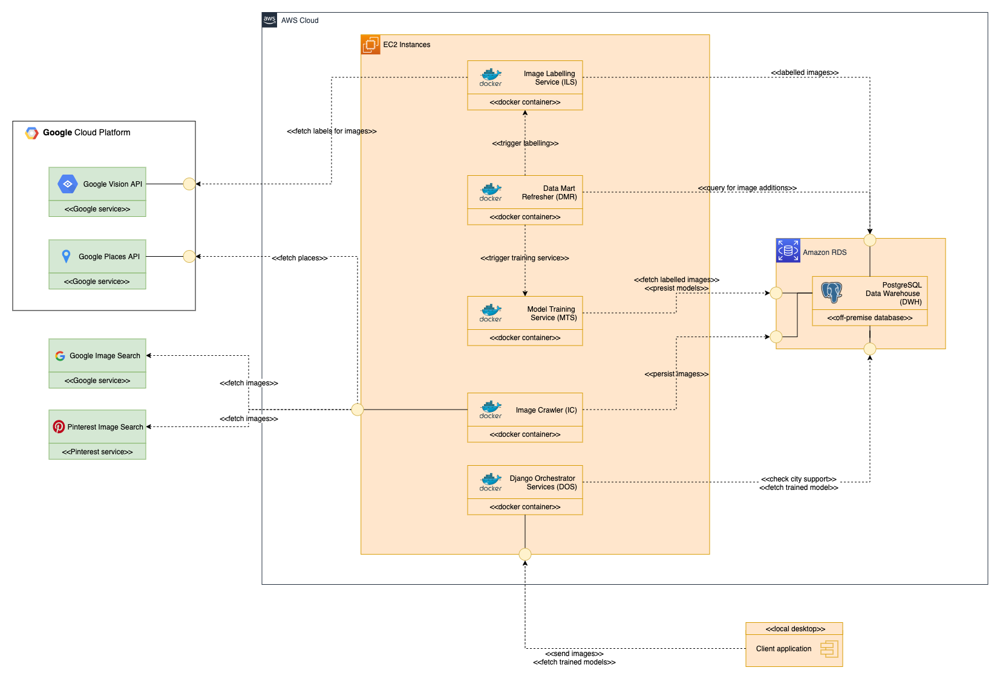
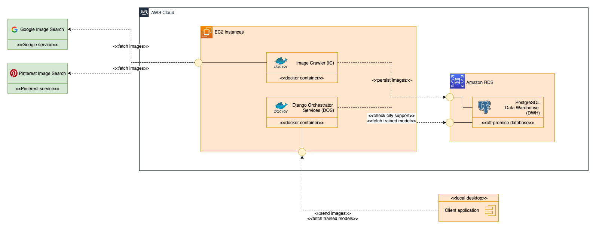
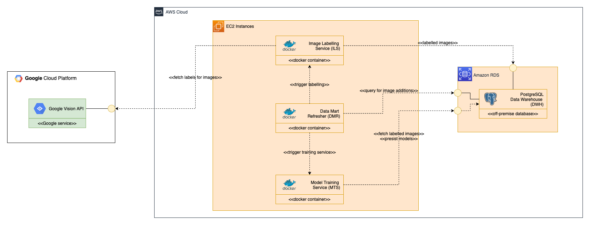

# **TECHNICAL DOCUMENTATION**

## _SightScan | AMOS Project Team 2_

# CORE INNER WORKINGS OF THE SOFTWARE

This documentation describes the technical structure and interconnections of the developed SightScan product, along with the involved technology stack SightScan incorporates.

These are the main technical components involved in our product:

_Technical components - overview_

**Image Crawling Pipeline**

Although the entirety of them might seem quite complex at first, the
implemented approach is rather natural here, which will become clearer
soon. For now, let's restrict the view by looking at the following four
key components:

_Technical components: Part I_

**Data Warehouse**

First, there is a full-fledged Data Warehouse for persisting sight images, labels and trained city models. The database schema relies on the star schema to enable fast queries from different data views and a high degree of extensibility down the line.

**Image Crawler**

Furthermore, an image crawler component (IC) was implemented. It uses the Google Places API to fetch the most popular sights for a given city and scrapes Google Image Search and Pinterest for images of a given sight and subsequently persists them in the data warehouse.

**Client**

The client, which is located on the bottom right side of the runtime components diagram, operates through a locally running Python desktop application. The Client Application is responsible for running the detection on video and photos, to integrate new cities into the system and to upload labelled images manually into the system.

**Django Orchestration Service**

Since it is desirable to decouple the frontend as much as possible from the backend, another abstraction layer was added: the Django Orchestration Service (DOS).

If the client initializes the sight prediction for a supported city, the DOS queries the database for the readily trained models and returns them to the client for offline client-side prediction. The DOS automatically triggers the image crawler to retrieve images for that city. Another use case is taking client images as input and persisting them in the data warehouse, so they can be used later for model training. This helps to facilitate real-world images to enhance the model performance eventually.

Moving on, three more advanced components have been implemented, as can be seen in the following diagram:

**Model Training Pipeline**

_Technical components: Part II_

**Model Training Service**

For one, a dedicated model training service (MTS) was developed that incorporates GPU acceleration to train our models. Specifically, it utilizes a YOLOv5 neural network architecture it yields good and fast prediction performance and is even suitable for live video streams.

**Image Labelling Service**

Beyond that, another component – the image labelling service (ILS) - also functions as an abstraction layer for automated labelling using the Google Vision API.

**Data Mart Refresher (DMR)**

With these two components in mind, it is shed light on a very crucial component – the Data Mart Refresher (DMR). It functions as the main contributor for the implemented automated model training pipeline.

As its name suggests, the DMR periodically refreshes the data mart layer of our data warehouse. However, it also simultaneously detects changes in the persisted data. With these insights, it notifies the model training service in two scenarios: When there is a new city yet without a trained model and when an existing city has more than 100 labelled images that are yet not considered in the city's most recently trained model.

Upon triggering by the DMR and subsequent training, the MTS again persists the newly trained model in the data warehouse for later use. Very similarly, the Data Mart Refresher also notifies the image labelling service when there are many new, but yet unlabelled images. After the ILS has automatically labelled these for a newly supported, it persists them in the database.

By putting all the previously described components back together in one image, the initially shown runtime components diagram can be deduced.

**Additional Information**

When one digs a little deeper into the component's; linkage, it becomes observable that the model training service, the image crawler, and the image labelling service asynchronously insert data into the data warehouse. Later on, the client application on the is merely interested in local sight prediction. Therefore, they download the trained model for a city from the data warehouse onto their device to predict locally.

What should furthermore be noted is that due to cost constraints, the Google Vision API is merely utilized for generating an initial data set for a city – not to extend the training set for an already supported city. Although being optional, this can e.g. be achieved by outsourcing the labelling task to the client application. In like manner, the image crawler accessing Google Image Search is also only triggered for initial city data set creations.

As pointed out before, the data mart refresher is responsible for three tasks: triggering the image labelling service for automated labelling, triggering the model training service for model training, and refreshing the data marts of the data warehouse. This is achieved by introducing a periodically-running cron job in this component.

Furthermore, one of the keys of the rather asynchronous software architecture is the existence of a dedicated load layer in the data warehouse that allows merging images, labels, and models into the existing core DWH and data marts in a decoupled manner.

# USE CASE: PIPELINE FOR ADDING CITY SUPPORT

Now, let's see how one rather complex use case has been implemented, which is adding new cities to the list of supported cities. Initially when the client selects a city name, it is sent to the orchestrating Django backend service. It triggers the image crawler with the selected city as an argument, which subsequently inserts the fetched images into the data warehouse. From this point onwards, the data mart refresher not only refreshes the data marts, but also detects changes in the images. Therefore, it also triggers the image labelling service subsequently, and the model training service whenever enough labelled images are available. At the very end, the model training service inserts the trained model into the warehouse and the Django orchestration service is able to return it upon the next client request.

# UTILIZED TECHNOLOGY STACK

Finally, the following technologies are incorporated in the SightScan ecosystem:

